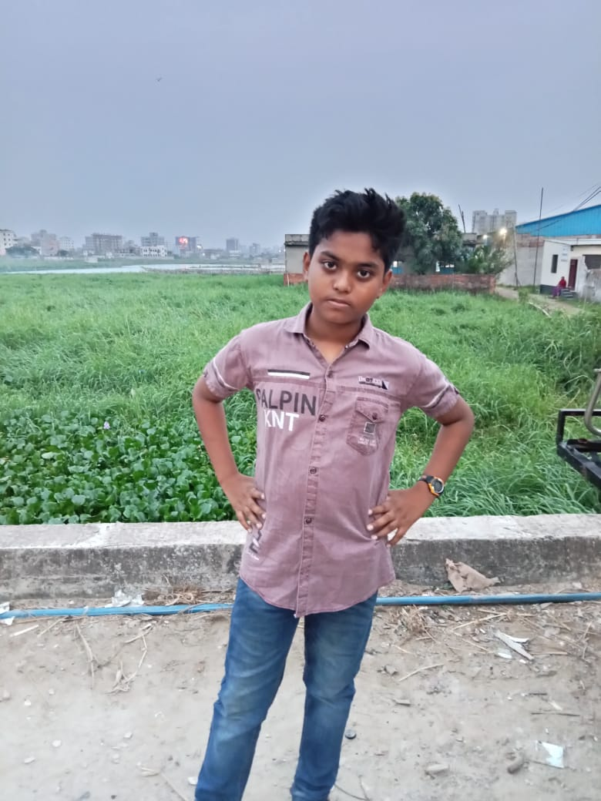

<!--markdown tutorial-->
 Mahi ISlam
<p>this is mahi i am read in class7

_mahi_x
~~mahi~~         
`this is inline`


```Javascprit
mahi islam
```


1.mahi 
2.abid
     1. abid1.1
- item 1
  - item1.1
- item2
https://github.com/


<br>
 <br>

![profile][def]

[def]: .imege/me.JPG.jpg.

😊